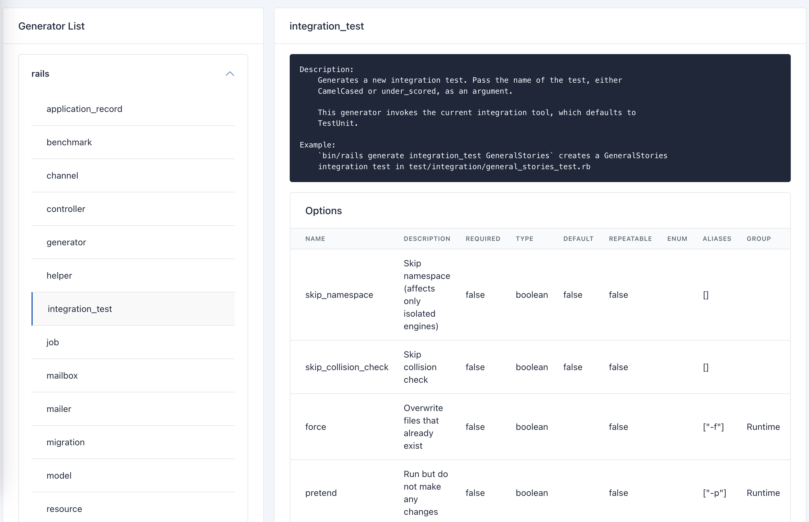

# DevHub

List all generators in one page.



## Installation
Add this line to your application's Gemfile:

```ruby
gem "dev_hub"
```

And then execute:
```bash
$ bundle
```

Or install it yourself as:
```bash
$ gem install dev_hub
```

## Usage
How to use my plugin.

```ruby
# add into routes
Rails.application.routes.draw do
  mount DevHub::Engine => "/dev_hub"
end

```

then visit [http://127.0.0.1:3000/dev_hub/generators](http://127.0.0.1:3000/dev_hub/generators)

## Contributing
Contribution directions go here.

## License
The gem is available as open source under the terms of the [MIT License](https://opensource.org/licenses/MIT).
